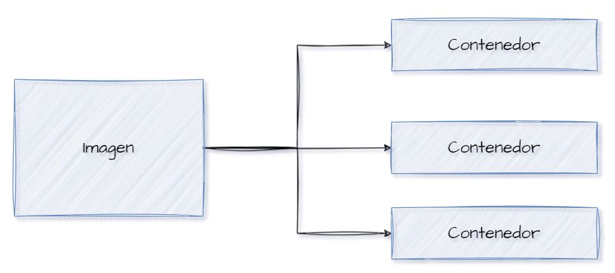
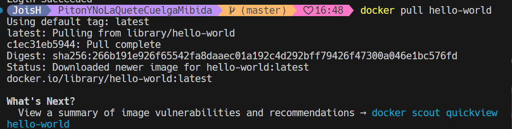
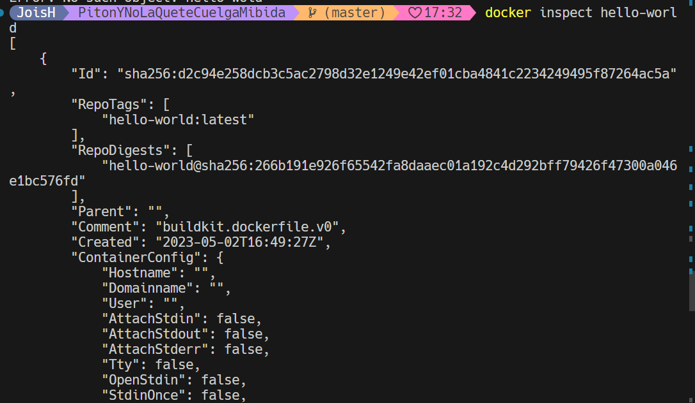
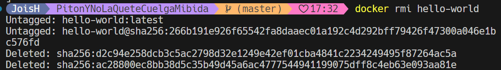

# Imagen
Es un archivo único que contiene todos los programas, librerías, dependencias y configuraciones necesarias para instalar y/o ejecutar una aplicación o un conjunto de aplicaciones.


## ¿Cuál es la relación entre una imagen y un contenedor? 
Imagen de Docker: Es un archivo estático que incluye todo lo necesario para ejecutar una aplicación: código, entorno de ejecución, librerías, variables de entorno y configuraciones. Se puede pensar en una imagen como una plantilla para crear contenedores.

Contenedor de Docker: Es una instancia en ejecución de una imagen. Cuando se inicia un contenedor, se toma una imagen, se agrega una capa de lectura-escritura encima de ella y se ejecuta el proceso especificado. Un contenedor representa una instancia específica y aislada de una aplicación.

Una imagen de Docker es un archivo estático que contiene todo lo necesario para ejecutar una aplicación, mientras que un contenedor de Docker es una instancia en ejecución de esa imagen. Puedes pensar en las imágenes como los planos de una casa y en los contenedores como las casas reales construidas en base a esos planos. Cada contenedor es una instancia única y aislada de la aplicación, pero todos comparten la misma imagen subyacente.



## Comandos para imágenes

### Descargar imagen
Descarga la última versión de la imagen disponible en el registro de Docker.

```
docker pull <nombre imagen> 
```

Descarga una versión específica de la imagen, cada imagen tiene etiquetas (tags) para diferentes versiones.
Una imagen puede tener la etiqueta latest para representar la última versión, si no se especifica una etiqueta se hará referencia a la versión latest.

```
docker pull <nombre imagen>:<tag>
```

Descargar la imagen **hello-world**
```
docker pull hello-world
```



**¿Qué es nginx**

En el contexto de Docker, NGINX es una de las muchas imágenes disponibles en el Docker Hub, que es un registro público de imágenes Docker. Estas imágenes contienen configuraciones predefinidas para ejecutar NGINX dentro de un contenedor Docker.

Cuando hablamos de "NGINX en Docker", nos referimos a la capacidad de ejecutar NGINX dentro de un contenedor Docker utilizando una imagen específica de NGINX disponible en el Docker Hub. Esto permite a los desarrolladores desplegar y ejecutar NGINX de manera fácil y portátil, ya que el contenedor Docker encapsula todas las dependencias y configuraciones necesarias para ejecutar NGINX de manera consistente en cualquier entorno de Docker compatible.


Descargar la imagen  **nginx** en la versión **alpine**
```
docker pull nginx:alpine
```


### Listar imágenes

```
docker images
```


**Identificadores**
En Docker, se utilizan varios identificadores para diferenciar de manera única los elementos del sistema, como imágenes, contenedores, volúmenes y redes. Estos identificadores son generados automáticamente por Docker y son únicos dentro del contexto del sistema Docker en el que se encuentran. 

### Inspeccionar una imagen
El comando docker inspect se utiliza para obtener información detallada sobre un objeto de Docker específico, como un contenedor, una imagen, un volumen o una red.  Proporciona información en formato JSON sobre el objeto especificado.

```
docker inspect <nombre imagen>
docker inspect <nombre imagen>:<tag>
```

Inspeccionar la imagen hello-world 

```
docker inspect hello-word
```





**¿Con qué algoritmo se está generando el ID de la imagen**
En Docker, los IDs de las imágenes se generan utilizando una función de hash criptográfico SHA256. Este algoritmo genera un hash único para cada imagen, basado en el contenido de la imagen y sus metadatos. El resultado es un identificador único de 64 caracteres hexadecimales que se utiliza para identificar de manera única cada imagen dentro del sistema de Docker. Este enfoque garantiza que cada imagen tenga un identificador único y que incluso pequeños cambios en el contenido o en los metadatos de la imagen produzcan un ID completamente diferente.


### Filtrar imágenes

```
docker images | grep <termino a buscar>

```

### Para eliminar una imagen
Eliminar permanentemente la imagen de tu sistema Docker.

```
docker rmi <nombre imagen>:<tag>
```

Eliminar la imagen hello-world 
```
docker rmi hello-world 
```




-f: Es la opción para forzar la eliminación de la imagen incluso si hay contenedores en ejecución que utilizan esa imagen.
Cuando eliminas una imagen Docker, Docker no elimina automáticamente los contenedores que se han creado a partir de esa imagen. Esto significa que, aunque hayas eliminado la imagen, el contenedor seguirá ejecutándose normalmente.  
**Considerar**
Eliminar una imagen no afecta a los contenedores que se han creado a partir de esa imagen, a menos que esos contenedores dependan de archivos o configuraciones específicas de la imagen eliminada. En ese caso, es posible que los contenedores se comporten de manera inesperada después de eliminar la imagen.
Es una buena práctica detener y eliminar todos los contenedores que dependan de una imagen antes de eliminar la imagen en sí.

```
docker rmi -f <nombre imagen>:<tag>
```

```
docker rmi -f hello-world
```
