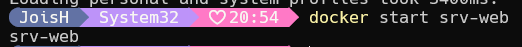

# Contenedores

### Crear un contenedor
Para crear un nuevo contenedor Docker a partir de una imagen específica, pero sin iniciarlo automáticamente. 

```
docker create --name <nombre contenedor> <nombre imagen>:<tag>
```
Crear el contenedor  **srv-web** usando la imagen nginx version alpine

```
docker create --name srv-web nginx:alpine
```


Si creas un contenedor en Docker sin asignarle un nombre específico utilizando la opción --name, Docker asignará automáticamente un nombre aleatorio al contenedor. Este nombre suele consistir en una combinación de palabras y números.  

Crear el contenedor usando la imagen hello-world
```
docker create hello-world
```


### Listar los contenedores ejecutándose o no

```
docker ps -a
```

### Para iniciar un contenedor

```
docker start <nombre contenedor o identificador>
```
Iniciar el contenedor srv-web 

```
docker start srv-web 
```




### Listar los contenedores ejecutándose
```
docker ps 
docker ps | grep <nombre contenedor>
```

### Para detener un contenedor

```
docker stop <nombre contenedor>
```

### Para crear un contenedor y ejecutarlo inmediatamente

```
docker run --name <nombre contenedor> <nombre imagen>:<tag>
```


Crear y ejecutar inmediatamente el contenedor **srv-web2** usando la imagen nginx:alpine

### Para crear el contenedor srv-web2 y ejecutarlo inmediatamente
```
docker run --name srv-web2 nginx:alpine
```


**¿Qué sucede luego de la ejecución del comando?**
Después de ejecutar el comando para crear y ejecutar el contenedor srv-web2 utilizando la imagen nginx:alpine, Docker iniciará el contenedor y NGINX comenzará a ejecutarse dentro de él, estando listo para servir contenido web según su configuración.


Cuando ejecutas un contenedor en primer plano sin la opción -d (modo detach), el contenedor captura la entrada estándar (stdin) del terminal, lo que significa que el terminal queda "atrapado" y no puedes introducir más comandos hasta que detengas el contenedor.

### Para crear un contenedor y ejecutarlo inmediatamente sin estar vinculados al mismo
-d: Es la opción que indica a Docker que ejecute el contenedor en segundo plano (en modo "detach").
Cuando un contenedor se ejecuta en segundo plano, Docker devuelve el control al terminal inmediatamente después de iniciar el contenedor, lo que permite al usuario seguir ejecutando otros comandos en el mismo terminal sin que el contenedor detenga la interacción.

```
docker run -d --name <nombre contenedor> <nombre imagen>:tag
```
Crear y ejecutar inmediatamente el contenedor **srv-web3** en modo detach usando la imagen nginx:alpine
```
docker run -d --name srv-web3 nginx:alpine
```


### Para eliminar un contenedor

```
docker rm <nombre contenedor>
```
Eliminar el contenedor que se creó a partir de la imagen hello-world 

```
docker rm modest_hertz
```


Verificar que el contenedor que se eliminó


# COMPLETAR

### Para eliminar un contenedor que esté ejecutándose

```
docker rm -f <nombre contenedor>
```
Eliminar el contenedor **srv-web3** 
```
docker rm -f srv-web3
```


Verificar que el contenedor que se eliminó


### Para inspecionar un contenedor 

Inspeccionar el contenedor **srv-web** 


Ejecuta el siguiente comando:
```
docker inspect srv-web
```


Este comando recuperará y mostrará información detallada sobre el contenedor srv-web, incluyendo su configuración, redes a las que está conectado, variables de entorno, montajes de volúmenes, y mucho más.

Si prefieres ver la salida de la inspección en un formato más legible, puedes combinar el comando con Format-List o Format-Table, así:

```
docker inspect srv-web | Format-List
```
o
```
docker inspect srv-web | Format-Table
```

