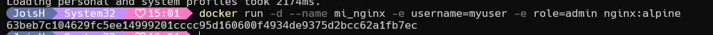
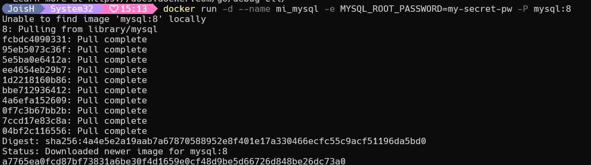

# Variables de Entorno
### ¿Qué son las variables de entorno
Las variables de entorno son valores dinámicos que pueden afectar el comportamiento de procesos que se ejecutan en un sistema operativo. Proporcionan una manera de configurar y personalizar la ejecución de programas y scripts sin necesidad de modificar su código fuente

### Para crear un contenedor con variables de entorno

```
docker run -d --name <nombre contenedor> -e <nombre variable1>=<valor1> -e <nombre variable2>=<valor2>
```

### Crear un contenedor a partir de la imagen de nginx:alpine con las siguientes variables de entorno: username y role. Para la variable de entorno rol asignar el valor admin.

```
docker run -d --name mi_nginx -e username=myuser -e role=admin nginx:alpine

```


# CAPTURA CON LA COMPROBACIÓN DE LA CREACIÓN DE LAS VARIABLES DE ENTORNO DEL CONTENEDOR 



### Crear un contenedor con mysql:8 , mapear todos los puertos



### ¿El contenedor se está ejecutando?
```
docker ps
```
El docker se está ejecutando 


### Eliminar el contenedor creado con mysql:8 
Para detener el contenedor
```
docker stop mi_mysql
```
eliminar el contenedor 
```
docker rm mi_mysql

```


### Para crear un contenedor con variables de entorno especificadas
- Portabilidad: Las aplicaciones se vuelven más portátiles y pueden ser desplegadas en diferentes entornos (desarrollo, pruebas, producción) simplemente cambiando el archivo de variables de entorno.
- Centralización: Todas las configuraciones importantes se centralizan en un solo lugar, lo que facilita la gestión y auditoría de las configuraciones.
- Consistencia: Asegura que todos los miembros del equipo de desarrollo o los entornos de despliegue utilicen las mismas configuraciones.
- Evitar Exposición en el Código: Mantener variables sensibles como contraseñas, claves API, y tokens fuera del código fuente reduce el riesgo de exposición accidental a través del control de versiones.
- Control de Acceso: Los archivos de variables de entorno pueden ser gestionados con permisos específicos, limitando quién puede ver o modificar la configuración sensible.

Previo a esto es necesario crear el archivo y colocar las variables en un archivo, **.env** se ha convertido en una convención estándar, pero también es posible usar cualquier extensión como **.txt**.
```
docker run -d --name <nombre contenedor> --env-file=<nombreArchivo>.<extensión> <nombre imagen>
```
**Considerar**
Es necesario especificar la ruta absoluta del archivo si este se encuentra en una ubicación diferente a la que estás ejecutando el comando docker run.

### Crear un contenedor con mysql:8 , mapear todos los puertos y configurar las variables de entorno mediante un archivo
```
docker run -d --name mi_mysql -e MYSQL_ROOT_PASSWORD=my-secret-pw -P mysql:8
```
Para ponerlo en un archivo
el archivo es .env
```
MYSQL_ROOT_PASSWORD=my-secret-pw
MYSQL_DATABASE=mydatabase
MYSQL_USER=myuser
MYSQL_PASSWORD=mypassword

```
y ejecutando 

```
docker run -d --name mi_mysql --env-file=mysql-env.env -P mysql:8

```


# COMPROBACIÓN DE LA CREACIÓN DE LAS VARIABLES DE ENTORNO DEL CONTENEDOR ANTERIOR 


Iniciar sesión en MySQL
```
mysql -u root -p
```
Ingresar la contraseña cuando se te pida (my-secret-pw).
```
SHOW DATABASES;
```
### ¿Qué bases de datos existen en el contenedor creado?
Listar las bases de datos


