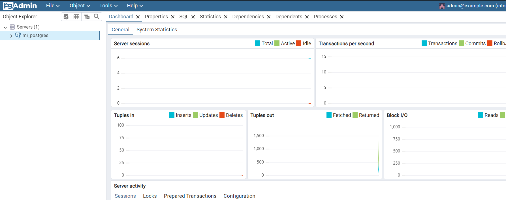

### Crear contenedor de Postgres sin que exponga los puertos. Usar la imagen: postgres:11.21-alpine3.17
Crear el Contenedor de PostgreSQL
```
docker run -d --name mi_postgres -e POSTGRES_PASSWORD=mysecretpassword postgres:11.21-alpine3.17
```

Comprobación
```
docker ps
```

### Crear un cliente de postgres. Usar la imagen: dpage/pgadmin4

Crear una red Docker personalizada:
```
docker network create my_network
```
Crear el contenedor de PostgreSQL en la red personalizada:
```
docker run -d --name mi_postgres --network my_network -e POSTGRES_PASSWORD=mysecretpassword postgres:11.21-alpine3.17
```
Crear el contenedor de pgAdmin en la red personalizada:
```
docker run -d --name pgadmin4 --network my_network -e PGADMIN_DEFAULT_EMAIL=admin@example.com -e PGADMIN_DEFAULT_PASSWORD=admin -p 80:80 dpage/pgadmin4
```
Configurar la Conexión a PostgreSQL desde pgAdmin
```
http://localhost
```

Nuevo Servidor en pgAdmin


detalles de los contenedores 
```
docker ps
```
La figura presenta el esquema creado en donde los puertos son:
- a: (5432) puerto por defecto de PostgreSQL en el contenedor
- b: (32769) puerto mapeado en el host para PostgreSQL
- c: (80) puerto mapeado en el host para pgAdmin


## Desde el cliente
### Acceder desde el cliente al servidor postgres creado.


### Crear la base de datos info, y dentro de esa base la tabla personas, con id (serial) y nombre (varchar), agregar un par de registros en la tabla, obligatorio incluir su nombre.
accede al contenedor de PostgreSQL
```
docker exec -it mi_postgres /bin/bash
```
inicia sesión en PostgreSQL como usuario postgres
```
psql -U postgres
```
Crear la Base de Datos
```
CREATE DATABASE info;
```
Conectar a la Base de Datos info
```
\c info
```
Crear la Tabla personas
```
CREATE TABLE personas (
    id SERIAL PRIMARY KEY,
    nombre VARCHAR(255)
);

```
Insertar Registros en la Tabla personas
```
INSERT INTO personas (nombre) VALUES ('Johanna'), ('Huaraca');
```


## Desde el servidor postgresl
### Acceder al servidor
### Conectarse a la base de datos info
Acceder al Contenedor de PostgreSQL
```
docker exec -it mi_postgres /bin/bash
```
Iniciar Sesión en PostgreSQL
```
psql -U postgres
```
Conectar a la Base de Datos info
```
\c info
```
select *from personas

