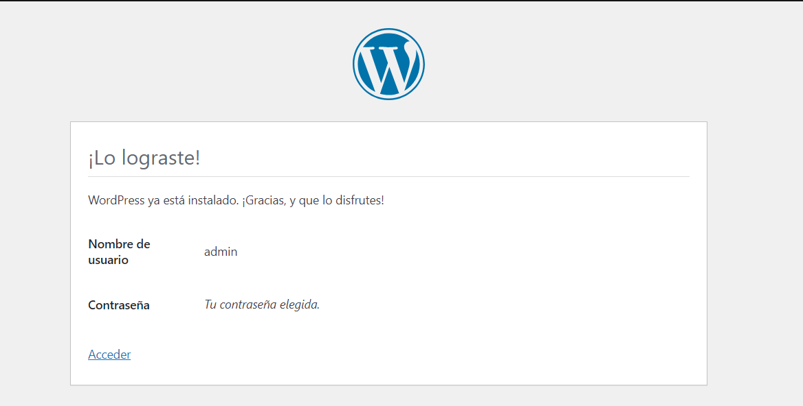
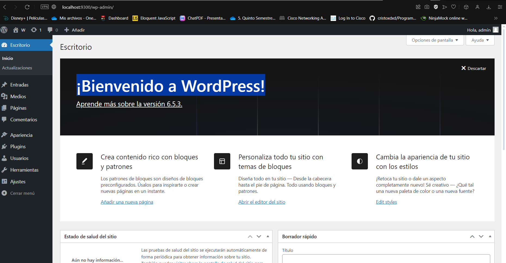
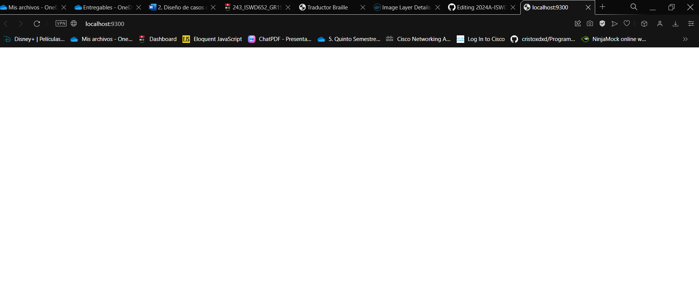

## Esquema para el ejercicio


### Crear la red
Crear la Red net-wp

```
docker network create net-wp
```
Crear el Contenedor de MySQL
```
docker run -d --name mysql --network net-wp -e MYSQL_ROOT_PASSWORD=my-secret-pw -e MYSQL_DATABASE=wordpress -e MYSQL_USER=wpuser -e MYSQL_PASSWORD=wppassword mysql:8

```
Crear el Contenedor de WordPress
```
docker run -d --name wordpress --network net-wp -e WORDPRESS_DB_HOST=mysql:3306 -e WORDPRESS_DB_NAME=wordpress -e WORDPRESS_DB_USER=wpuser -e WORDPRESS_DB_PASSWORD=wppassword -p 9300:80 wordpress

```

###Acceder a WordPress
Abre para completar la configuración de instalación de WordPress.
```
http://localhost:9300/
```
Ingresar desde el navegador al wordpress y finalizar la configuración de instalación.



¡Bienvenido a WordPress!

Cambia el tema desde la sección de Apariencia.

Crea una nueva publicación.

visualizar


De acuerdo con el trabajo realizado, en la el esquema de ejercicio el puerto a es **(9300)**

### Eliminar el contenedor wordpress

Eliminar el Contenedor de WordPress
```
docker rm -f wordpress
```
Crear Nuevamente el Contenedor de WordPress
```
docker run -d --name wordpress --network net-wp -e WORDPRESS_DB_HOST=mysql:3306 -e WORDPRESS_DB_NAME=wordpress -e WORDPRESS_DB_USER=wpuser -e WORDPRESS_DB_PASSWORD=wppassword -p 9300:80 wordpress

```

Acceder Nuevamente a WordPress
Abre
```
http://localhost:9300/
```
### Crear nuevamente el contenedor wordpress
Ingresar a: http://localhost:9300/ 
recordar que a es el puerto que usó para el mapeo con wordpress

### ¿Qué ha sucedido, qué puede observar?
Se quedo asi




